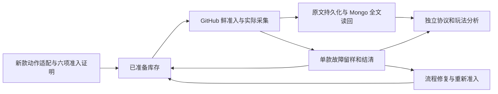

# SG 采集机制、代码与全部资料交接

交接日期：2026-10-03（北京时间）。基线代码：`22e57021185c8d35c7717fe8e051308cb54ce39c`。工作目录固定为 `E:\platform-sync\sg-capture-runner`，不要采用聊天环境显示的 D 盘目录。本文及索引只整理交接，不启动、停止或派发采集，不修改原额度、已应用许可或服务器业务状态。

## 1. 接手先知道的实际情况

**累计完成 17/178；当前已准备可采集库存为 0；最近源任务已经结束，没有新的游戏正在实采。四个本机进程仍存活，但四条自动持续工作链路没有全部打通。**

已完成游戏编号：32471、32630、32633、32651、32704、32711、32721、32723、32726、32737、32745、32746、32747、32795、32799、32833、32836。该列表来自本次保存的准入库存快照，与最新完成报告一致；本交接没有重做这 17 款的远程终审。

最近实采的是 32714 Huff N’ Puff Money Mansion High Limit。最新源 `37119129319:1` 新增 627 完整局，1 局中断留样，累计 1416 条完整记录已逐条 receipt/Mongo 全文核对。该游戏没有完成 300000 目标。源已自动结清，pending、待写、计数预约均为 0，campaign activeGame 为 null，池 disabled。新的 BET→FREE_GAME FID3 动作分支尚未适配，已撤销该次准备证明并进入修复。

最近远程业务只读快照：`.local/four-lines-20261003/common-display-ended-state-1791028082-private.json`，返回时间 `1791028086`（约 19:48 北京时间）。本次另保存本机进程和库存快照到 `.local/handoff-20261003/`。这些是**带时间的交接证据，不能当成下一次派发前的新鲜现场**。

| 本机线 | 本次核对 PID | 实际能力及当前状态 |
| --- | --- | --- |
| 新游戏准入 | 7776 | 固定处理器执行已有检查、收集六项证明；无活动 claim、无 prepared 库存；不能自动编写未知游戏适配 |
| 流程修复 | 22900 | 消费故障回放并核已有实现；32714 当前真实 FID3 样本仍 `HUFF_FEATURE_NOT_ADAPTED` |
| 协议/玩法分析 | 20228 | 独立消费不可变记录，结构观察和分类；不能替代流程适配代码生产 |
| 采集交接 | 13640 | 生成/传递交接任务和证据；本机没有 SG 源权限，不等于 GitHub 正在采集 |

本次逐 PID 核对 `node.exe`、脚本路径和 lane 均相符。PID 会变化，接手必须重新核锁的实际 owner，不能仅以 PID 或启动日志认定存活。`sg-30` 是用户要求暂停的定时任务，后续不要自动恢复或另建替代心跳。

### 必须纠正的旧表述

- 以前“进程正常运行”“四线已通”“持续推进”的部分表述混淆了进程存活、检查通过和自动生产能力。当前不具备完整自动持续准入→采集→故障转修复→下一款→修复返回闭环。
- 不能说“只准入过一款”：32714、32812 Very Fruity 都曾有 prepared 证明；后来真实源失败使对应证明撤销。**当前 prepared=0**，历史 `<gameId>-result.json` 的 prepared 不是当前许可。
- 原准入 worker 只固定支持 9 个处理器：32636、32714、32718、32719、32720、32812、32739、32820、32835。151 款缺差异适配证据时直接 blocked，等待外部新增证据；让它继续空转不会产出新适配。
- 32714 当前故障是未经验证的 FID3 请求分支，不是已修好的免费追加、小数展示或奖池编号重复出错。修复应从新的实际动作入手。
- 更早“native 范围命令被审批拒绝”的 9 月 30 日阻塞已经解决，不是当前停采原因。另有后台自动派源动作曾被审批拒绝，不能把它描述成已经运行的第四采集进程，也不能换壳绕过被拒动作。

## 2. 用户要求和正确的处理机制

最终目标为 SG 第一轮 178 款各累计 300000 个完整普通 buy0 大局。没有第二轮 buy/additional；300000 数量完成不等于全部玩法覆盖。

用户要求四条线独立、同时持续推进：新款准入生产、流程修复、协议/玩法分析、源采集消费。单款动作缺口留样、结清并撤销对应 proof 后，采集应立即取另一款已准入游戏；修复通过后重新回到正常队列。没有 prepared 库存时应真正生产下一款适配，不能只等待或反复执行相同失败检查。

参考 AG 的核心是**动作流程与玩法语义分开**：已验证的下一步动作继续请求，完整原文、身份和金额证据先保存；陌生展示字段、尚未分类的玩法不阻断已验证流程。未解释分类保留 pending/null，不能伪造普通玩法。未知请求出口、错误会话/金额、终态不明和存储确认未知仍需保护，不是任意字段宽松解析或盲目一直 FREE。



图是目标机制，不是全部实现状态。当前缺少未知游戏的适配/证据生产，以及已经准备库存到真实跨游戏自动接力的完整验收。公共资源/空间/存储故障保留共同保护；不能为了“采集不停”跳过完整性。

本地规则以 [rules.md](E:/platform-sync/sg-capture-runner/docs/rules.md)、[continuous-processing.md](E:/platform-sync/sg-capture-runner/docs/continuous-processing.md) 最新条目为准。用户已授权持续推进和 routine 修复；接手不要每个模块完毕就停下来询问。阶段超过 5 分钟没有推进，记录具体运行命令或阻塞。正常动作不等 20 分钟心跳、不等报告完成才启动下一阶段。

## 3. 当前库存与统计口径

本次快照原件为 `.local/handoff-20261003/admission-inventory-private.json`、`repair-inventory-private.json`，摘要在 `status-private.json`。

| 库存文件 | 当前全部 178 个镜像任务状态 | 要注意 |
| --- | --- | --- |
| admission/inventory.json | 153 blocked / 17 complete / 8 queued | blocked：151 ADAPTER_DIFFERENCE_EVIDENCE_REQUIRED；32714 NATIVE_REPAIR_REPLAY_REQUIRED；32812 REAL_CAPTURE_FLOW_FAILURE_SETTLEMENT_AND_REENTRY_PENDING |
| repair/inventory.json | 151 queued / 17 complete / 10 blocked | 其中 151 queued 属于 admission lane，不是 151 款修复游戏；10 blocked 为 9 PREPARATION_GATES_PENDING + 1 ADAPTER_DIFFERENCE_EVIDENCE_REQUIRED |

准入镜像标记 repair lane 的 10 个游戏：32636、32714、32717、32718、32719、32720、32739、32812、32820、32835。**这只是本机 lane 标签列表**；原生真实修复数量还要按 native repairKey、结清和故障状态独立核，不能把镜像所有 queued/blocked 当真实异常数。

协议结果目录目前 13 个版本：9 semantic-review-required、3 classified、1 analysis-input-requires-review。其中 3 个 classified 是同一条独立记录的不同版本，不能称已分析 3 条不同记录。无活动 claim 不等于没任务；也不能称正在自动写完缺失适配。

当前 32714 回放输入：

`.local/preparation-worker/repair/evidence-inbox/354777ad2916ef8f40176f93931b6c48b5f09ad8d1ba641326b7838c1fb515fa.json`

包含 5 份故障（4 历史中断 + 1 本次新增）。查当前结果要按 flow-results 的 `taskHash` 对齐此输入，不能取任意“最新文件”。`PREPARATION_REPLAY_FAILURE_CHANGED` 等历史拒绝不是当前 FID3 的真实根因。

## 4. 代码导航：四线、证据和采集控制

全部代码、配置、测试、报告的逐文件清单见 [源码资料索引](E:/platform-sync/sg-capture-runner/docs/sg-handoff-source-index-20261003.json)。索引的 SHA256 是**本机文件字节 hash**，不是已注册 profile 的 canonical hash，也不是协议源码 LF-normalized hash；不可混用。

| 机制 | 入口或关键文件（均相对仓库根目录） | 交接重点 |
| --- | --- | --- |
| 四线启动与身份 | scripts/start-work-lines.ps1；scripts/preparation-worker.mjs；scripts/protocol-analysis-worker.mjs；scripts/capture-handoff-worker.mjs | StatusOnly 不启动；锁绑定实际脚本/lane；不要重复开进程或清 live lock |
| 固定检查器 | scripts/runner-v2/preparation-handlers.mjs | 9 款固定测试，缺未知适配生产；首要机制缺口 |
| 库存/六门槛 | preparation-inventory.mjs；preparation-revision.mjs；preparation-replay-evidence.mjs | route、settlement、persistence、local、linux、native；proof sourceAllowance=0，不授源额度 |
| 发布与选择 | preparation-publication-cycle.mjs；prepared-publication-handoff.mjs；prepared-campaign-selector.mjs；prepared-stock-review.mjs | 发布证明与在线鲜准入分开；静态 prepared-inventory 可能过期或已撤销 |
| 特征复用 | scripts/feature_reuse_index.py；.local/preparation-worker/*/feature-index.json | 按实际方法、engine、计数、终态差异分组；命中候选不直接 ready |
| 流程修复 | flow-repair-task.mjs；flow-repair-executor.mjs；flow-repair-inbox.mjs；native-repair-replay.mjs | 全历史批次分页+真实故障；只回放旧局，不请求旧会话；缺适配不能伪造 gate |
| 协议分析 | protocol-analysis-task.mjs；confirmed-flow-evidence.mjs；confirmed-analysis-task.mjs；round-analysis-journal.mjs | 分类 sidecar；不改原文/额度，不阻断已验证动作，不等于自动流程修复 |
| 本机状态/邮箱 | atomic-local-state.mjs；work-line-mailbox.mjs；work-line-events.mjs | unique temp、fsync、rename；未完成 claim 隔离；事件拒绝按版本保留 |
| 加密证据交接 | work-line-evidence-export.mjs；work-line-sealed-evidence.mjs；work-line-evidence-delivery.mjs；work-line-artifact-reader.mjs；work-line-evidence-pump.mjs | 线上固定只读导出→密封→本机核当前代码→消费；不公开原文和密钥 |
| 源故障绑定 | capture-fault-receipt.mjs；capture-fault-delivery.mjs；capture-preparation-binding.mjs | 正式计划与基础计划 hash 分别绑定，精确撤销原 proof，迟到故障不撤销新 proof |
| 正式 prepared 采集 | prepared-count-authorization.mjs；prepared-count-plan.mjs；prepared-count-admission.mjs；prepared-count-control.mjs；prepared-count-runtime.mjs | 独立注册 profile/runtime/activation/run；新会话继承原完成数及剩余目标 |
| 结清和重新入队 | prepared-ended-source.mjs / -control.mjs；prepared-count-parking.mjs；prepared-settled-history.mjs；retire-count-pool.mjs | ended source 已自动退休的不要再发维护；全批次读回、租约结清后绑定修复 |
| 已收到终局保全 | received-terminal-records.mjs；count-shared-close.mjs / -control.mjs | 独立终态和金额核验后保存，不把完整终局丢成 abandoned |
| 计数/持久化/保护 | complete-count.mjs；campaign.mjs；durable-queue.mjs；mongo-writer.mjs；resource-gate.mjs；lease-boundary.mjs | 一会话一在途，意图与全文先持久化，全文 Mongo 读回才 checkpoint，非 maxseq 数量 |
| 授权注册表 | config/preparation-plan-bindings.json；prepared-inventory.json；prepared-count-authorizations.json；prepared-runtime-authorizations.json | 不能因文件存在就认定当前有效，核注销/撤销/当前代码/实际身份 |

上表仅省略重复前缀：除四线脚本、service、config 和 .local 外，未写目录的 `.mjs` 都在 `scripts/runner-v2/`。所有对应测试也列在源码索引；接手先验证改动影响，不重复全部已通过广测。

| GitHub workflow | 职责 |
| --- | --- |
| .github/workflows/trial-300k.yml | 唯一 SG 源；每仓最多 20 Ubuntu-hosted，primary 0–19 / secondary 20–39 |
| .github/workflows/demo-maintenance.yml | 无源结清、激活、退休；没有 SG 请求许可 |
| .github/workflows/work-line-evidence.yml | 固定只读 native 证据、加密交接 |
| .github/workflows/preflight.yml | Linux 离线必要预检，不采集 |

## 5. 已做的公共方法与验证，不要再逐款重写

Python：`service/free_game_counters.py`、`feature_state.py`。Runner：`scripts/trial/free-game-counters.mjs`、`feature-state.mjs`。Collector：`collector/free-game-counters.cjs`、`feature-state.cjs`。三方保持独立实现。

- 免费追加默认支持自然授奖，总数=剩余+已执行；耗用与新增守恒，显式追加值另核。已接 Mansion HardHat、Jinzita、Luxor，不默认套所有游戏动作。
- 有序历史槽位可重复，保留原顺序及前槽；不能把重复 PCFID 当追加授奖。
- 功能中赢分可以尚未入可用余额，终局仍要求完整到账，响应钱包独立核。
- 展示小数保留原字串和精度，不用现金整数解析器误拒。
- 32714 官方奖池展示编号 -1/-2/-3/-4/-5 与后续 Mansion 功能哨兵 -100 分开；未知编号仍拒绝，不能将全部负数判现金/终局。HardHat 和 TouchUp 已迁移。
- 真实响应已经收齐时独立确认终局和完整金额后保全；不补请求、不重放、不误作废。

调用点：`service/huff_fields.py`、`huff_touchup_review.py`、`huff_retrigger_review.py`；`scripts/trial/huff-protocol.mjs`、`huff-touchup-review.mjs`、`huff-retrigger-review.mjs`；`collector/sg.huff-touchup.ts`、`sg.huff-retrigger.ts`；`service/round_fields.py`。

两个已修交接竞争条件：`bindNativeRepairAdvance(event,current)` 对精确旧 repairKey/故障和当前有效 proofHash、无 claim 做 fencing，防后台先重建旧 proof 卡住新故障；`flowRepairBindingRevision(current)` 让 game/lane/nativeRepairKey/故障 hash 改变后重新评估一次拒绝，普通 tick、时间和 proof 重建不导致重复回放。不要删除这些保护来“提速”。

最新公共代码完整 Linux：secondary `37118563262`，runtime `8f18f2614ca73bc798a5f3c8c26f5e45140b3d9c`，11:06:03Z→11:08:41Z，success。完整 log SHA `20acb739337b74681f48e015a87d0a9d6e223d9f46b03e6d93c2aa46cfb48b33`。此后准入/文档提交不等于重新实现公共代码。

详见 [公共规则与实采](E:/platform-sync/sg-capture-runner/docs/common-feature-rules-20261003.md)、[结果](E:/platform-sync/sg-capture-runner/docs/common-feature-rules-result-20261003.json)、[全历史槽位交接](E:/platform-sync/sg-capture-runner/docs/work-lines-persistent-slots-20261003.md)。TouchUp 完整终态仍只有合成证据，不能宣称所有玩法自然终局均覆盖。

## 6. 最新实际运行与冻结证据

| 动作 | run / 结果 | 不可误用的事实 |
| --- | --- | --- |
| 789 结清 | 37117398806 / success | 原299保留，489补写，1十帧自然终局保全，新增作废0，789全文读回；不要重新关 |
| 重新入队交接 | 37118335216 / success | 当前代码交接实际通过；当时 prepared 证明后来已撤销 |
| 独立无源激活 | 37118930270:1@bcd9496 / success | 789基线、目标300000、剩余299211，不新增100试点 |
| 实采 | 37119129319:1@bcd9496 / failure，finalizer success | 701响应/628BET/627完整/1中断；FID3动作缺口停款；自动结清已完成 |
| 只读新故障交接 | 37119895135@bcd9496 / success | 5份真实故障与当前 native 身份绑定，源额度0；未给当前 prepared |

最后实采代码提交 `bcd9496f3981dd2743385a153a39c5c5f378e686`；source logs SHA `b04fe8c4ae20bfd8359df95cbae1950c638f5e0f38e0df13563c17581a941b96`。只读交接 logs SHA `d6e079272c8a871458b3fcc7cc0025c4c171c7d3184bd28d8b57461a59496a2d`。

最后已应用 profile：

`config/formal-prepared-count-32714-44d5d6176fd103b4649e7f143b114d8eac78876eae3ce4b42230631fdac2b015.json`

canonical `ab3a1725aaed0213fb3e82a323a9f6d5ef2247b48a7d342632a189c810f1bfdb`；注册 1007 runtime 文件，baseline789，target300000，maxSequence600000。**已应用永久冻结，不能改期、复用旧源许可或刷新额度。**当前剩余目标要从1416及已结清真实账本重新绑定，不能机械使用基线时299211。

最近不可变关闭及故障身份：

| 项目 | 值 |
| --- | --- |
| closureKey | count-prepared-close:sg_r1_20260928_32714:37119129319:1:complete |
| closureHash | c4089a7da65e4b968b50d99b589ea80f74ea03adc0f9878082e80d4220ae7183 |
| retirementKey | retired-count:sg_r1_20260928_32714:583ac9497493c7b6 |
| retirementHash | 8fceae7014b61096b202b86c85d1a6cba7b257422f3ea60bc034b1d6b977b8d9 |
| recordsHash | b53e951e095b7f851bc1cc27a5ca6c163870eeb0e104c76c4fc3701226aee7b4 |
| nativeRepairKey | game-repair:sg_r1_20260928_32714:8e0608df1fc685d8129218a4bd24629364bd0e1883b547af45d765aa7697cc3b |
| failureEvidenceHash | 6c7edb1b562ff93722d18ca94538ef96a4383b2339217aeb08c7206218055c10 |
| 已撤销 proofHash | 1bdd3f3ebb7c2349bcc949981c8521a7ab6e2a0a21f8ee388ca6dc43f87dfb33 |

真实新故障：BET FID0/NFG1/TFG1/CFGG0、GSD MMBG1；随后 FREE_GAME **FID3**/NFG6/TFG6/CFGG0/FEAT MMANSION/PCFID0/NEXTFRAMES/MMW。保留两帧原文，不能猜终局或要求旧会话 INVALID_SESSION。此前 FID2 TouchUp 的模板不自动证明 FID3 路由。

1416 全文场景：`.local/four-lines-20261003/common-display-1416-paged-scene-1791027229-private.json`，95批次/1416receipts/1416Mongo。审查 `common-display-1416-after-review.json`、`review-common-display-1416-private.mjs`。增量 `common-display-1416-delta-private.json` 新增627只存一次，旧789引用前档案；还原核原hash，不重复上传。

### 其他游戏待办身份

- 32812 Very Fruity：历史六门槛曾prepared，真实失败已撤销，目前 `REAL_CAPTURE_FLOW_FAILURE_SETTLEMENT_AND_REENTRY_PENDING`，本机 admission nativeRepairKey=null。已有试点结清 used1/foregone99/complete0 的历史报告，接手鲜读其原生状态后绑定当前正式修复；不能拿旧prepared继续。官方 Spin 是 Logic+Stake/PaylineCount/AccountData，Close 是 EndGame，不套 Rhino WagerInfo/Pearl readyForEndGame。
- 32719 Inca：十次免费真实前缀已有生产支持；另一 Hold/coin 分支还缺完整动作/金额一致实现。独立检查已进行，不叫整款修好。
- 32718 Morepuff：FID2=Wheel，已关闭39已用/61注销，91完整保留。混合后续功能另审，不能借注销61或再建100试点。旧轮盘VM和定位不用重做。
- 32636/32720/32739/32820/32835 等旧试点额度已结清，留样、旧完整及 applied profiles 保留；具体新修复按当前 native 身份，不能沿旧报告恢复旧会话。

## 7. AG 参考、效率资料和下一步优先级

AG 只读参考根路径：`E:/platform-sync/api_new/api.numeric/capture/capture-ag`。先核路径存在再读，禁止改动。关键文件 `scripts/rolling-worker.ts`、`src/ag.scheduler.ts`、`src/ag.round.ts`、`src/ag.client.ts`、`src/ag.mongo.ts`。这些是历史实际代码对照入口；不要只凭文件名声称又完成了对照。本次索引另记录存在的外部参考文件及其字节 hash。

已有 SG 对照与效率报告：

| 阅读顺序 | 文档 | 解决的问题或限制 |
| --- | --- | --- |
| 1 | docs/four-work-lines-integration-20261003.md；preparation-producer-consumer-20261003.md | 四线交接、正式计划、真实入口；各节日期是历史阶段，不能把旧“待Linux/已prepared”当当前 |
| 2 | docs/ag-mode-isolation-20260930.md；ag-direct-action-integration-20261002.md | 动作与语义分离、单款故障隔离及请求出口 |
| 3 | docs/ag-preparation-method-reuse-20261002.md | 固定47客户端实际方法hash复用，24.89秒扫描；engine override 差异仍审 |
| 4 | docs/ag-efficiency-stage-acceptance-20261002.md；efficiency-acceptance-20261002-result.json | 各项离线/部署/实测分开，全部效率完成不是true |
| 5 | docs/ag-count-audit-metadata-20261002.md | Pyramids已正式300000终审，102.316秒审计；不重采 |
| 6 | docs/ag-state-delta-efficiency-20261002.md；ag-next-batch-read-efficiency-20261002.md；ag-resource-sample-flight-efficiency-20261002.md | 控制状态增量、读回缓存、资源观察，不减少新鲜owner和持久化保护 |
| 7 | docs/morepuff-latency-audit-20260930.md及-result.json | 09:35→15:39的6h4m，近5h未解释间隔82.36%，不是必要适配/GH排队，不能编造根因 |

本机已有候选资料：`.local/preparation-worker/admission/available-gls-clients-private.json`、`gls-family-discovery-private.json`、`selected-gls-engines-review.json`、`review-selected-gls-engines.mjs`，以及各 `<gameId>-result.json`。`.local/ag-request-method-reuse-20261002/` 保存请求方法复用证据。已经有 GLS/WMS 普通 Init/Spin/Close 候选族；32760 还有 Select，32810 有 BigBetSpin，不能统一套所有分支。

**优先完成生产能力，而不是继续只跑检查器：**

1. 从已识别的请求家族实现可执行的新款动作适配生产链：固定客户端/engine差异→路由与身份/金额/终态契约→Python/Runner/collector一致实现→持久化→六门槛。只分析新的差异，先积累多款prepared，不把32714修复当唯一主线。
2. 并行推进32714真实FID3和其他真实修复项；流程正确即重新准入，玩法语义由另一条线继续。修复代码生产能力与当前“回放失败等待”区分。
3. 打通准备发布与GitHub源消费者的真实跨游戏自动接力：故障结清后取下一prepared；精确fresh证明、注册许可、旧额度继承和唯一派发保持。capture-handoff本身不是在线执行者。
4. 用真实运行验收至少两个不同游戏的准入产出，以及一次“游戏故障→另一prepared款实采→原游戏修复后返回”的闭环；这是建议验收案例，不是已授权凭空下注试探。不靠单元夹具或PID存活宣称闭环完成。

历史预检到实采7m53（最后Linux11:08:41Z→源派发11:16:34Z）只是一次阶段时长观测，不是吞吐提速百分比。已有两组预检比较和多会话canary报告可复用；未验收的新并发不能直接扩大，不为测量取消健康源。先修已证实的重复读取、串行空档和无产出等待，再测实际收益。

## 8. 全部资料索引与私有档案

本次整理不是把原始响应塞进公开文档，而是提供完整导航和逐文件检索。**原文、PID/session/key/startURL、logZIP、私有读写脚本和密钥保持私有原位置；不能 git add `.local` 或粘贴 upload 脚本/payload。**

| 文件/位置 | 内容 |
| --- | --- |
| docs/sg-handoff-source-index-20261003.json | 基线 Git tracked 全部源码/配置/测试/文档/卡片，路径、字节数和SHA256 |
| .local/handoff-20261003/materials-private.json | `.local` 全部资料逐文件路径、字节数、SHA256、读时变更/错误；排除清单明确列出，不跟随junction |
| .local/handoff-20261003/archives-private.json | 从上述清单提取全部tar.gz/zip和服务器readback结果路径 |
| .local/handoff-20261003/status-private.json | 本次本机库存/进程摘要；claim/prepared与不同分析记录数 |
| .local/handoff-20261003/external-references-private.json；ag-reference-source-index-private.json | 固定官方客户端及AG关键文件hash；AG参考源码全目录文本文件索引，仅只读，不复制到SG源码包 |
| .local/handoff-20261003/source-snapshot.zip | 最终交接提交的Git源码/配置/全部公开文档快照；不含`.local`私有原文 |
| .local/handoff-20261003/handoff-package.zip | 本文、源码快照、两个资料索引、本次状态快照、校验清单；大体量原文仍在原路径，不重复复制 |
| .local/four-lines-20261003/ | 最新四线运行、正式授权、原文、1416分页读回、source/maintenance/evidence完整日志和增量备份结果 |
| .local/preparation-worker/ | admission/repair库存、证据inbox/outbox/flow-results、特征索引、状态与固定启动日志 |
| .local/protocol-analysis-worker/；capture-handoff-worker/；work-line-evidence/ | 独立分析结果/邮箱/证据和派发交接 |
| .local/efficiency5/；optimization3/4；各ag-*目录 | 各阶段私有效率测量、AG参考、canary和授权/回放 |
| .local/mansion-next/；morepuff-boundary/；inca-next/；pilot-close/；ag-pilot/ | 已完成候选审查与旧有限试点，原始样本及冻结资料；不重导出旧全文 |

索引排除 node_modules、.git、__pycache__、重复 worktree、符号链接/junction 和索引自身。运行中的状态可能变化，索引记录是否在读取时变化；真实派发仍鲜读，不用索引字节hash替换认证流程。

最新备份均已有原两端逐文件readback结果；本次**没有重新上传/重新验证服务器旧档案**。服务器引用路径为固定 review store 的 `reviews/<档案名>/full.tar.gz`，实际受限操作从已有脚本/manifest读取，不猜绝对路径。

| 本机档案名（.local下同名.tar.gz） | 文件数 / 压缩字节 | SHA256 |
| --- | --- | --- |
| work-lines-common-terminal-prepare-20261003 | 30 / 847135 | 51f1badff20116a933603a45e3a41a0de6cf43562f468a8abc71a756dcfa42ed |
| work-lines-common-terminal-final-20261003 | 51 / 971792 | 03563dad699af32452016b332d948c5bd63400579117e52b30ab625ad0ba0a2b |
| work-lines-common-display-prepare-20261003 | 33 / 777595 | 44af8907e736a0508318679465305e8f70a5bba52d2de52340c6a4ea4f87cf29 |
| work-lines-common-display-final-20261003 | 63 / 1395604 | 0bcfd1562a0c41bdaaa0334e7b665bfb4f5e5a97cffe748ff16de0b339b9f76a |
| work-lines-common-display-reentry-prepare-20261003 | 22 / 92050 | fab8bfcabe9b1f6eddf59762a2a2cd770987b308fa6895fd55e9809084002bb7 |
| work-lines-common-display-reentry-final-20261003 | 22 / 955630 | 52796e66aa8c2abf7eeec761ae70997823c780280cd188d0a81c07d0a1e766d4 |

789完整样本在display-final；1416的新增627在reentry-final，引用旧789。不要重上传旧全文。其余全部旧档案及 readback result 由 archives-private.json 检索。`archive-*.py`、upload-private等脚本通常有assert不覆盖或嵌入payload，**不要为整理再运行**。

官方只读固定32714 app.js：

`E:/platform-sync/api_new_docker/api_new/client/game/sg/static/ogs-cdn-usnj.nyxop.net/html5/huffnpuffmoneymansionhighlimit/js/app.js`

SHA `67bcebfd2f16477c8c3b2686b6e10b70f41bde3579d929e89e04e321ffa4e93d`；旧 VM `.local/mansion-next/client-boundary.mjs`已审 FID2 TouchUp 等方法，UI/动画/transport是桩，无自然完整终局证明。现在只补FID3实际差异，不整轮重定位/重做旧VM。

32718同一官方根下 `huffnmorepuffhighlimit/js/app.js`，SHA `48898ee09234a8c2388358e6f1f0f760e79f18f7f9290f14b8f87e42a6ffd469`；计划slug的96后缀不是缓存目录。FID2=Wheel，CFGG对应Bb.Wf/NFG对应Bb.Ee；不套Jinzita独立FID1免费模板。

## 9. 环境、权限边界与安全操作

仓库：`zyzuoyang/sg-capture-runner`（primary）和 `287113535qq-cmyk/sg-capture-runner`（secondary），非敏感源码/报告双仓同步。本次整理前双仓main为22e570；最终交接提交及推送结果见package manifest。`origin`是primary，没有名为secondary的remote；副仓使用显式HTTPS地址。

Python `C:/Users/xxx/AppData/Local/Programs/Python/Python314/python.exe`，设置PYTHONUTF8=1；子检查设置PYTHON同一路径。GH `C:/Users/xxx/.codex/tools/github-cli/2.101.0/bin/gh.exe`。网络操作使用已验证本机代理 `http://127.0.0.1:10090`、GODEBUG=http2client=0；git禁本轮自动gc/maintenance，http.lowSpeedTime30。不要退出CLI、扩大OAuth、换账户或改billing。

当前shell默认Windows PowerShell直接执行`.ps1`可能因执行策略拒绝；本次状态核对使用只读CIM检查，不改策略、不重启进程。需要启动时先读固定启动器，核owner和未完成claims，不能以换工具绕过自动审批拒绝的同一后台派源动作。

- 所有SG请求、在线业务解析/金额校验/调度/清理只在GitHub。本机离线开发/只读；服务器只受限nativeMongo、metrics、私有固定文件I/O，绝不SQL或游戏。
- Mongo仅 `sg_capture_staging_v1` 的 `official_rounds`、`capture_state_v2`、`capture_journal_v2`；生产不写。api_new/capture及api_new_docker只读。旧Beaver node_modules junction不删。
- 一会话一在途；intent和完整response持久化才发下一请求；Mongo全文readback才checkpoint；真实completecount而非maxseq。写入确认未知不重发、不猜结果。
- 中断半局留样后作废并移出活动pending；不续接、不补救、不重放旧BET、不要求INVALID_SESSION。已收到完整终局保全，健康在途功能正常走完；不能反复丢同类功能虚报覆盖。
- CPU/RAM>=95或metrics>30秒停写；10秒采样均<90连续60秒只解resourcehold。disk<30GiB停新BET/批次，25GiB尾局；spacehold不自动解。健康只读不用select。
- 先campaign确认trial；全部pool及相关batch按当前nextBatchId分页≤100，不固定旧总数、不截断库。1416不使用旧每trial<1000的小helper。所有已应用profile/runKey/close永久保留；未应用到期profile不能派发。
- 最新native范围已安装20款，32714 runtime33114/target300000/maxseq600000；manifest历史验证SHA `61f246875cbab0ca154c840437fbef6288d8abd7ea9fafa0aec6179b0351fdc5`。恢复前鲜核，别安装旧13/12范围。
- 历史精确queued只在鲜核workflow/attempt/head/jobs0后隔离：36525403196@7296147c426188d2ca0bd4a7738471e062a8b2da、36612306276@c433f74c5ef4bda1cbe3cbde9ec17fffe0122b44、36854881370@38465d0872529e80bc09c60218892c14581162c0；都是primary trial-300k attempt1 workflow_dispatch。不要等、诊断、重派或添加任意ignorelist；源前仍核其他活动。
- 178卡由service/game_rule_catalog.py与scripts/build-game-rule-archive.py维护；提交/发布前生成/check，防stale重复Linux。运行证据绑定的旧commit不因写报告变成新源许可。

## 10. 给接手对话的起始指令

将下段连同本文路径交给新对话即可。不要从本聊天早期心跳重新推断最新状态。

```text
接手 SG 第一轮178款各300000完整buy0采集。先读 E:\platform-sync\sg-capture-runner\docs\sg-handoff-20261003.md 和 docs/rules.md、continuous-processing.md；源码全索引为docs/sg-handoff-source-index-20261003.json，私有全索引及本次快照在.local/handoff-20261003。
当前17/178，prepared0，最后32714累计1416完整已全文读回、源37119129319已自动结清，新FID3故障待动作适配。四本机进程存活但不是全自动闭环。不要复用已撤销proof、旧run许可、已应用profile或旧会话，不重做完成的关闭/VM/旧全文归档。
首要工作是补真正的新款适配/证据生产及跨游戏采集消费闭环，不继续只让9款固定检查器对151款blocked空转。利用已有GLS/WMS家族和实际方法hash差异资料，新款准入、流程修复、协议分析独立持续推进；动作验证通过即采，玩法语义pending不阻断。32714 FID3和VeryFruity/Inca等修复按最新真实证据独立处理。
每一步用真实记录和实际入口验收；进程存活、合成单元测试、过去prepared或静态索引不能宣称已上线。正常必要修复持续推进，不每个小模块结束就询问；进度按真实产出和当前运行汇报。不要恢复sg-30定时任务。实际新源仍必须GitHub唯一workflow、当前独立许可及fresh owner/额度/租约/资源/身份核验。
```

交接包不等于9GB级全部原始样本复制；它包含全部资料的路径和校验索引。另一台机器或没有本机文件访问能力的对话，需要由用户另外提供相应私有档案，不能宣称这些资料已自动共享到任何新对话。
